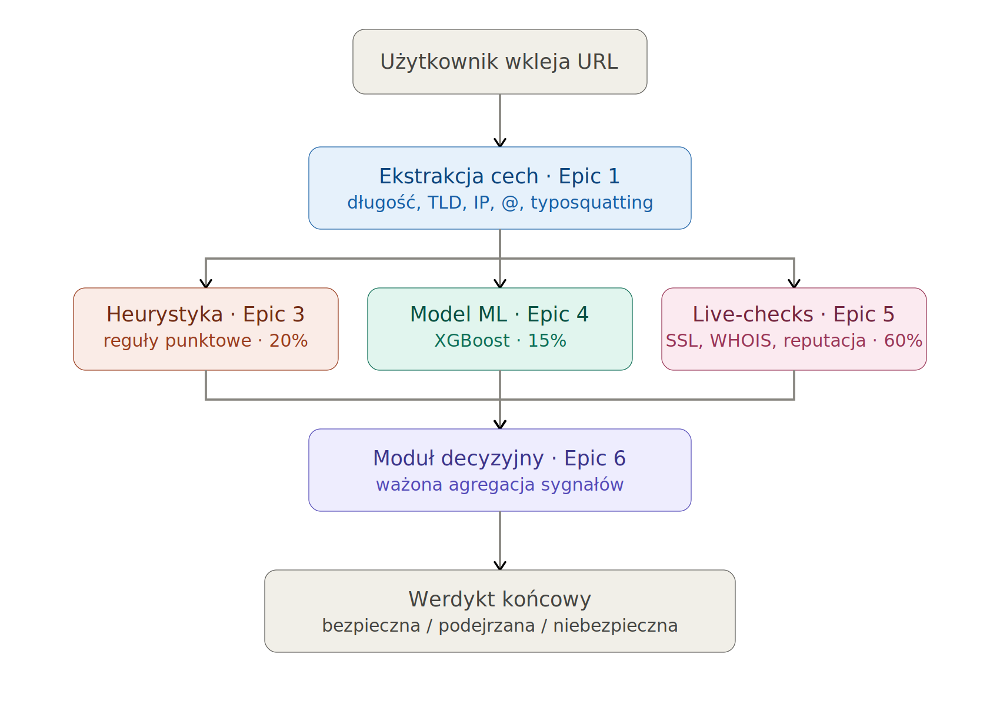

# PhishBait — Narzędzie do wykrywania phishingu

Aplikacja webowa, która analizuje URL (lub treść e-maila) i zwraca
werdykt ryzyka — **bezpieczna / podejrzana / niebezpieczna** — wraz
z procentowym prawdopodobieństwem i listą konkretnych sygnałów, które
złożyły się na tę decyzję.

Projekt zrealizowany jako praca inżynierska. Łączy heurystykę opartą
na regułach, wytrenowany model uczenia maszynowego oraz sprawdzenia
w czasie rzeczywistym (SSL, WHOIS, Google Safe Browsing) w jedną,
wytłumaczalną decyzję.

## Architektura



Każde z trzech źródeł sygnału może zawieść niezależnie od pozostałych
(brak wytrenowanego modelu, wszystkie sprawdzenia na żywo przekroczą
limit czasu) bez wpływu na resztę — moduł decyzyjny przelicza wtedy
wagi na dostępnych źródłach, zamiast domyślnie traktować brakujące
dane jako "bezpieczne". Zobacz `backend/decision.py`.

## Stos technologiczny

- **Backend:** Python, FastAPI, scikit-learn, XGBoost
- **Frontend:** React (Vite), czysty CSS (ciemny motyw, glassmorphism)
- **Pipeline ML:** pandas, skrypty treningowe uruchamiane offline (nie przy każdym zapytaniu)

## Struktura projektu

```
PhishBait/
├── backend/
│   ├── main.py              aplikacja FastAPI, endpoint /api/analyze
│   ├── analyzer.py          orkiestracja całego pipeline'u
│   ├── schemas.py           kontrakty request/response API (Pydantic)
│   ├── url_features.py      Epic 1 - ekstrakcja cech leksykalnych
│   ├── heuristics.py        Epic 3 - punktacja oparta na regułach
│   ├── live_checks.py       Epic 5 - SSL/WHOIS/Safe Browsing/przekierowania/nagłówki
│   ├── live_scoring.py      zamienia wyniki live-checks na wynik liczbowy
│   ├── ml_predictor.py      wczytuje i odpytuje wytrenowany model (Epic 4)
│   ├── decision.py          Epic 6 - łączy wszystkie trzy źródła
│   ├── models/              wytrenowany model (generowany, poza gitem)
│   ├── .env                 sekrety - klucz Google Safe Browsing (poza gitem)
│   └── tests/                testy jednostkowe i API (pytest)
├── frontend/
│   └── src/
│       ├── components/       VerdictCard, SignalsList, ProbabilityBar, ThreatMap
│       └── styles/
├── ml/
│   ├── download_dataset.py         pobiera PhiUSIIL (UCI)
│   ├── build_features.py           ponownie ekstrahuje cechy przez url_features.py
│   ├── augment_with_legit_domains.py   + Tranco (naprawia obciążenie gołych domen)
│   ├── augment_with_kaggle_paths.py    + Kaggle (naprawia obciążenie brakiem ścieżki)
│   ├── train.py                    trenuje i porównuje LR / RF / XGBoost
│   ├── evaluate.py                 Epic 7 - wewnętrzna ewaluacja na wydzielonym zbiorze
│   ├── evaluate_external.py        Epic 7 - ewaluacja na zbiorze zewnętrznym
│   ├── FINDINGS.md                 udokumentowane ograniczenia modelu ML i ich naprawy
│   └── data/                       datasety (generowane, poza gitem)
└── requirements.txt
```

## Instalacja

### 1. Backend

```bash
cd PhishBait
python -m venv venv
venv\Scripts\activate          # Windows
# source venv/bin/activate     # macOS/Linux

pip install -r requirements.txt
```

Utwórz `backend/.env` (skopiuj `backend/.env.example`) i dodaj klucz
Google Safe Browsing API:
```
GOOGLE_SAFE_BROWSING_API_KEY=twoj_klucz
```
Zobacz https://console.cloud.google.com/ → APIs & Services → włącz
"Safe Browsing API" → Credentials → Create API Key. Aplikacja działa
też bez tego klucza, ale sprawdzenie Safe Browsing z Epic 5 zostanie
pominięte.

### 2. Pipeline ML (jednorazowo, przed pierwszym uruchomieniem)

Wytrenowany model **nie jest** w repozytorium (duży plik, w pełni
odtwarzalny z poniższych skryptów). Z folderu `ml/`:

```bash
cd ml
python download_dataset.py
python build_features.py
python augment_with_legit_domains.py
python augment_with_kaggle_paths.py    # wymaga darmowego konta Kaggle (logowanie w przeglądarce)
python train.py
```

To wygeneruje `backend/models/phishing_model.joblib`. Całość zajmuje
kilka minut, głównie `train.py` na finalnym zbiorze ~780 tys. wierszy.

### 3. Frontend

```bash
cd frontend
npm install --legacy-peer-deps
```
(`--legacy-peer-deps` jest potrzebne, bo `react-simple-maps` deklaruje
wsparcie tylko do React 18, mimo że działa poprawnie na 19.)

### 4. Uruchomienie

```bash
# terminal 1
cd backend
uvicorn main:app --reload --port 8000

# terminal 2
cd frontend
npm run dev
```

Otwórz http://localhost:5173.

## Testy

```bash
cd backend
python -m pytest tests/ -v
```

Obejmuje ekstrakcję cech URL, punktację heurystyczną, predykcje ML
(w tym testy regresyjne dla wcześniej wykrytego obciążenia danych,
zobacz `ml/FINDINGS.md`) oraz działający endpoint API.

## Epiki

| Epic | Zakres | Status |
|---|---|---|
| 1 | Ekstrakcja cech URL | Gotowe |
| 3 | Punktacja heurystyczna | Gotowe |
| 4 | Model ML (trening, porównanie, ewaluacja) | Gotowe |
| 5 | Sprawdzenia na żywo (SSL, WHOIS, Safe Browsing, przekierowania, nagłówki) | Gotowe |
| 6 | Moduł decyzyjny (łączy Epic 3/4/5) | Gotowe |
| 7 | Ewaluacja (metryki, macierz pomyłek, heurystyka vs ML vs hybryda) | Gotowe |
| 8 | Kontrakt API (URL/e-mail → werdykt/prawdopodobieństwo/powody) | Gotowe |
| 9 | Interfejs użytkownika | Gotowe |
| 2 | Analiza treści e-maila (presja czasowa, prośby o dane wrażliwe) | Niezrealizowane - zobacz Ograniczenia |

## Znane ograniczenia

- **Epic 2 (analiza treści e-maila) nie jest zrealizowany.** Interfejs
  przyjmuje treść e-maila i wyciąga z niej pierwszy URL, który jest
  następnie analizowany normalnie - ale nie ma dedykowanej analizy
  samej treści wiadomości (słowa presji czasowej, generyczne powitania,
  prośby o dane wrażliwe).
- **Model ML ma udokumentowany, częściowo złagodzony słaby punkt** dla
  legalnych URL-i ze ścieżką, wykryty i szczegółowo zbadany podczas
  developmentu. Zobacz `ml/FINDINGS.md` po pełny proces
  diagnoza → naprawa → weryfikacja oraz wynikające z niej kompromisy.
  Właśnie dlatego moduł decyzyjny nadaje modelowi ML tylko 15% wagi
  finalnego werdyktu.
- **Sprawdzenia na żywo wymagają prawdziwego dostępu do internetu**
  i dodają 1-5 sekund opóźnienia na zapytanie; są pomijane w bezpieczny
  sposób (nie traktowane jako "bezpieczne"), gdy są niedostępne.

## Datasety i cytowania

- Prasad, A. & Chandra, S. (2024). *PhiUSIIL: A diverse security
  profile empowered phishing URL detection framework.* Computers &
  Security. (główne dane treningowe)
- Le Pochat, V. i in. (2019). *Tranco: A Research-Oriented Top Sites
  Ranking Hardened Against Manipulation.* NDSS 2019. (uzupełnienie
  legalnych domen głównych)
- sid321axn (2021). *Malicious URLs dataset.* Kaggle. Zbudowany
  z ISCX-URL2016, PhishTank, PhishStorm. (uzupełnienie URL-i ze ścieżką)
- Potpelwar, R. (2024). *PhishLegitURLs.* Mendeley Data,
  DOI: 10.17632/j43jtv3zzc.1. (zewnętrzny, nigdy nietrenowany zbiór ewaluacyjny)

## Możliwe kierunki rozwoju

Udokumentowane, ale niezaimplementowane: analiza SMS-ów (smishing),
skanowanie kodów QR, rozszerzenie do przeglądarki do ochrony w czasie
rzeczywistym, zgłaszanie URL-i przez społeczność zasilające mapę
zagrożeń prawdziwymi danymi, panel z historią sprawdzeń.