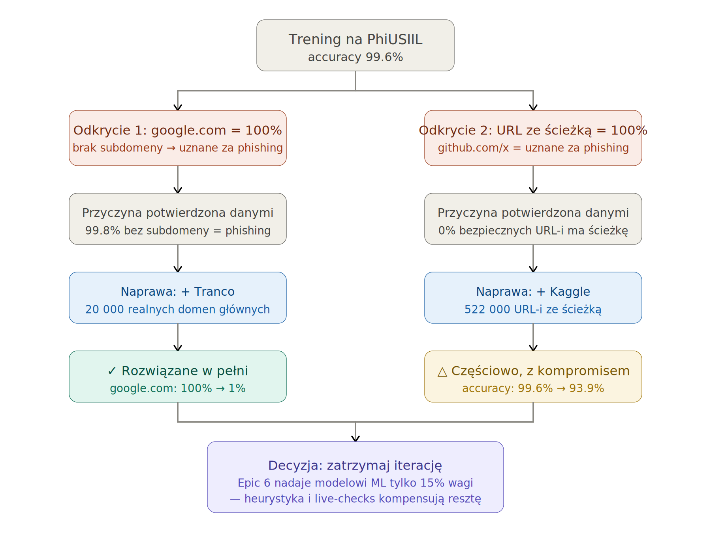

# Odkrycia i ograniczenia modelu ML

Ten dokument opisuje konkretne badanie metodologiczne przeprowadzone
podczas developmentu modelu: dwa obciążenia (biasy) w danych zostały
wykryte przez systematyczne testowanie, jedno zostało w pełni
naprawione, a drugie częściowo, z udokumentowanym kompromisem. Trzymam
to jako osobny dokument, bo jest bezpośrednio istotny dla Epic 7
(ewaluacja) i pokazuje iteracyjny proces diagnoza-hipoteza-weryfikacja
stosowany w całym tym projekcie.

## Oś czasu

### 1. Trening początkowy (tylko PhiUSIIL)

Model został najpierw wytrenowany wyłącznie na datasecie PhiUSIIL
Phishing URL (Prasad & Chandra, 2024 - 235 795 URL-i, 134 850
legalnych / 100 945 phishingowych). Metryki offline wyglądały
znakomicie:

| Model | Accuracy | Precision | Recall | F1 | ROC-AUC |
|---|---|---|---|---|---|
| XGBoost | 99.60% | 99.86% | 99.21% | 99.53% | 0.9982 |

### 2. Odkrycie 1: goła domena główna błędnie klasyfikowana

Ręczne testy sprawdzające (spoza wewnętrznego podziału train/test)
wykazały, że dobrze znane, bezpieczne domeny główne - `google.com`,
`github.com` - dostawały od wytrenowanego modelu 100% prawdopodobieństwa
phishingu, mimo że model poprawnie rozpoznawał oczywiste wzorce
phishingowe (typosquatting, adresy IP, obfuskację przez `@`).

**Przyczyna, potwierdzona danymi:** wśród wszystkich 15 682 wierszy
PhiUSIIL z `subdomain_count == 0`, **15 654 (99.8%) było oznaczonych
jako phishing** - tylko 28 było legalnych. Model nauczył się reguły
"brak subdomeny = niemal na pewno phishing", co jest prawdziwe w obrębie
tego datasetu, ale fałszywe w prawdziwym świecie (wpisanie `google.com`
zamiast `www.google.com` jest całkowicie normalne).

**Naprawa:** dodano ~20 000 prawdziwych, dobrze znanych domen głównych
z listy Tranco (Le Pochat i in., "Tranco: A Research-Oriented Top Sites
Ranking Hardened Against Manipulation", NDSS 2019), oznaczonych jako
legalne.

**Wynik:** w pełni rozwiązane. Wszystkie przypadki testowe gołych domen
głównych (`google.com`, `github.com`, `microsoft.com`, `amazon.com`,
`apple.com`, `netflix.com`, `reddit.com`, `spotify.com`, `mozilla.org`,
`python.org`, `wikipedia.org`) są teraz poprawnie klasyfikowane
(< 30% prawdopodobieństwa phishingu), a znane wzorce phishingowe
pozostały poprawnie wykrywane. Zobacz `ml/augment_with_legit_domains.py`
oraz
`backend/tests/test_ml_predictions.py::test_bare_root_domains_are_low_risk`.

### 3. Odkrycie 2: URL ze ścieżką błędnie klasyfikowany

Drugie, pokrewne obciążenie zostało znalezione tym samym sposobem:
legalne URL-e ze ścieżką (`docs.python.org/3/`, `github.com/torvalds/linux`,
`en.wikipedia.org/wiki/Phishing`) również dostawały blisko 100%
prawdopodobieństwa phishingu.

**Przyczyna, potwierdzona danymi:** wśród wszystkich wierszy PhiUSIIL
z `has_path == True`, **zero było oznaczonych jako legalne** - wszystkie
27 456 to phishing. Klasa "legalna" w PhiUSIIL składa się niemal
wyłącznie z gołych URL-i strony głównej (zwykle z subdomeną `www`,
nigdy ze ścieżką), co samo w sobie jest węższą i mniej realistyczną
próbką "legalnego ruchu webowego", niż sugerowałby rozmiar datasetu.

**Próba naprawy:** dodano ~522 000 wierszy z drugiego, niezależnie
zebranego datasetu (Kaggle, `sid321axn/malicious-urls-dataset` -
zbudowanego z ISCX-URL2016, PhishTank i PhishStorm), który zawiera
prawdziwe, crawlowane URL-e ze ścieżką zarówno dla klasy bezpiecznej,
jak i phishingowej.

**Wynik: częściowy, z udokumentowanym kompromisem.** Większość
dotkniętych przypadków testowych została naprawiona, ale nie wszystkie
- i co ważne, ogólne metryki offline na połączonym datasecie
**spadły**:

| Model | Accuracy | Precision | Recall | F1 | ROC-AUC |
|---|---|---|---|---|---|
| XGBoost (PhiUSIIL + Tranco) | ~99.6% | ~99.9% | ~99.2% | ~99.5% | ~0.998 |
| XGBoost (+ Kaggle, finalny) | 93.92% | 91.63% | 83.38% | 87.31% | 0.976 |

To samo w sobie jest znaczącym wnioskiem: **dołożenie większej ilości
danych nie zawsze automatycznie poprawia model.** Dokumentacja
datasetu Kaggle sama przyznaje, że łączy kilka niezależnie
etykietowanych źródeł, co "wprowadza ryzyko różnej jakości oryginalnych
datasetów i ich etykietowania". Spadek recall (99.2% → 83.4%) sugeruje,
że połączony dataset jest bardziej "zaszumiony", a model przegapia
teraz więcej prawdziwych przykładów phishingu niż wcześniej, mimo że
lepiej generalizuje na szerszą różnorodność kształtów legalnych URL-i.

## Decyzja

Biorąc pod uwagę malejący, a w tym przypadku wręcz **ujemny** zwrot
z dalszego łatania datasetu, iteracyjne dokładanie danych/cech zostało
zatrzymane w tym miejscu, zamiast kontynuować w nieskończoność. Wspierają
to dwa argumenty:

1. **Ograniczenie czasowe.** To praca inżynierska z terminem, nie projekt
   badawczy bez końca - w pewnym momencie dalsze gonienie za pojedynczymi
   przypadkami brzegowymi ma gorszy stosunek kosztu do zysku niż przejście
   do reszty wymaganej pracy.

2. **System nie polega wyłącznie na ML.** Moduł decyzyjny
   celowo nadaje modelowi ML tylko 15% wagi finalnego werdyktu, właśnie
   dlatego że żadne pojedyncze źródło sygnału nie jest doskonałe.
   Reguły heurystyczne (20%) i sprawdzenia na żywo (60% - ważność SSL,
   wiek domeny, Google Safe Browsing, zachowanie przekierowań)
   kompensują dokładnie ten rodzaj martwego punktu: fałszywy alarm
   samego modelu ML na legalnym URL-u ze ścieżką jest ściągany w dół
   przez live-checks, które nie znajdują nic więcej złego.

## Co pozostaje znanym ograniczeniem

Model ML, w izolacji, wciąż błędnie klasyfikuje niektóre legalne URL-e
ze ścieżką, gdy jest trenowany na danych dostępnych dla tego projektu.
Jest to udokumentowane tutaj zamiast ukryte, i spodziewane jest, że
będzie widoczne w wynikach ewaluacji Epic 7 (szczególnie na jakimkolwiek
zewnętrznym zbiorze testowym nieużywanym w treningu - zobacz zarezerwowany
dataset Mendeley PhishLegitURLs, celowo nietknięty właśnie w tym celu).

## Cytowania

- Prasad, A. & Chandra, S. (2024). *PhiUSIIL: A diverse security profile
  empowered phishing URL detection framework based on similarity index
  and incremental learning.* Computers & Security.
- Le Pochat, V., Van Goethem, T., Tajalizadehkhoob, S., Korczyński, M.,
  & Joosen, W. (2019). *Tranco: A Research-Oriented Top Sites Ranking
  Hardened Against Manipulation.* NDSS 2019.
- sid321axn (2021). *Malicious URLs dataset.* Kaggle. Zbudowany
  z ISCX-URL2016 (Mamun i in., 2016), PhishTank i PhishStorm (Marchal
  i in., 2014).